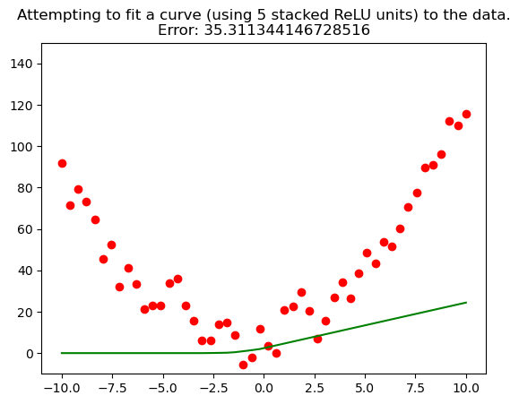
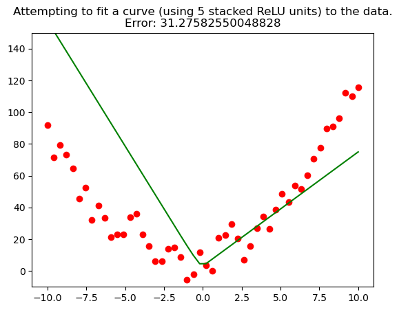
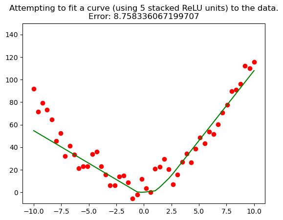
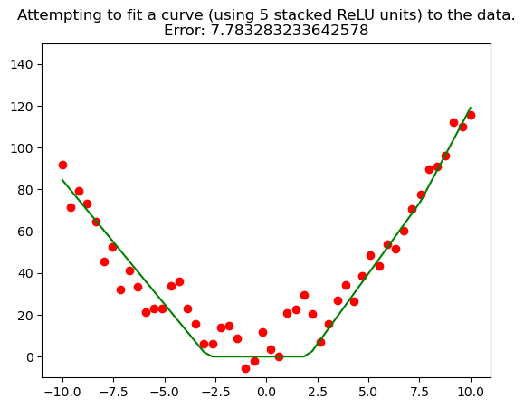

# Overview
This repository contains a Jupyter Notebook demonstrating the approximation of continuous functions using Rectified Linear Units (ReLU).  
The notebook explores how ReLU activation functions, commonly used in neural networks, can be employed to approximate continuous mathematical functions.  
It includes detailed visualizations and code examples to illustrate the concepts.  
# Example
The following images show function approximations using multiple stacked ReLUs at different intervals.
-  
- 
- 
- 

